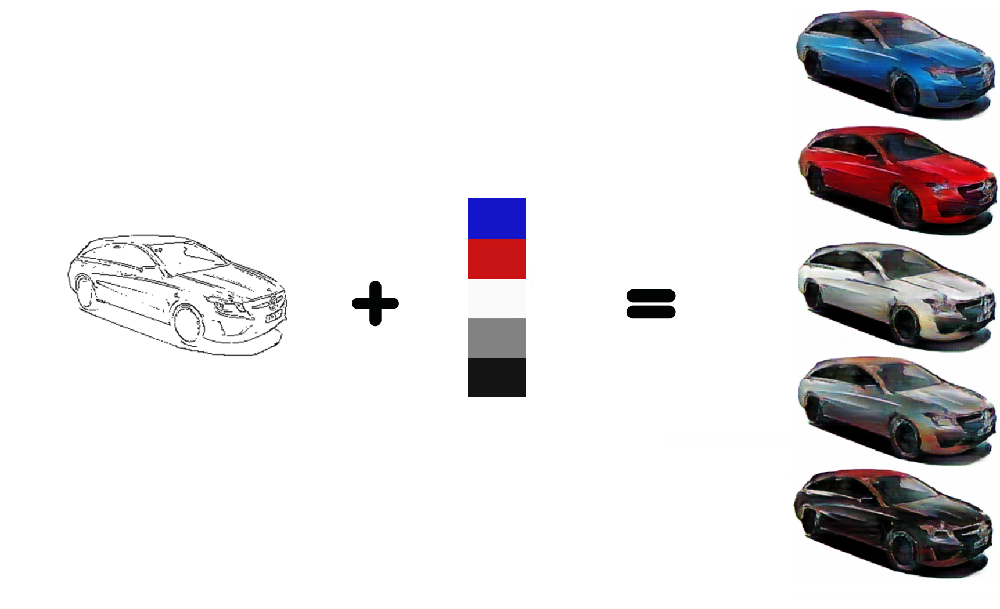
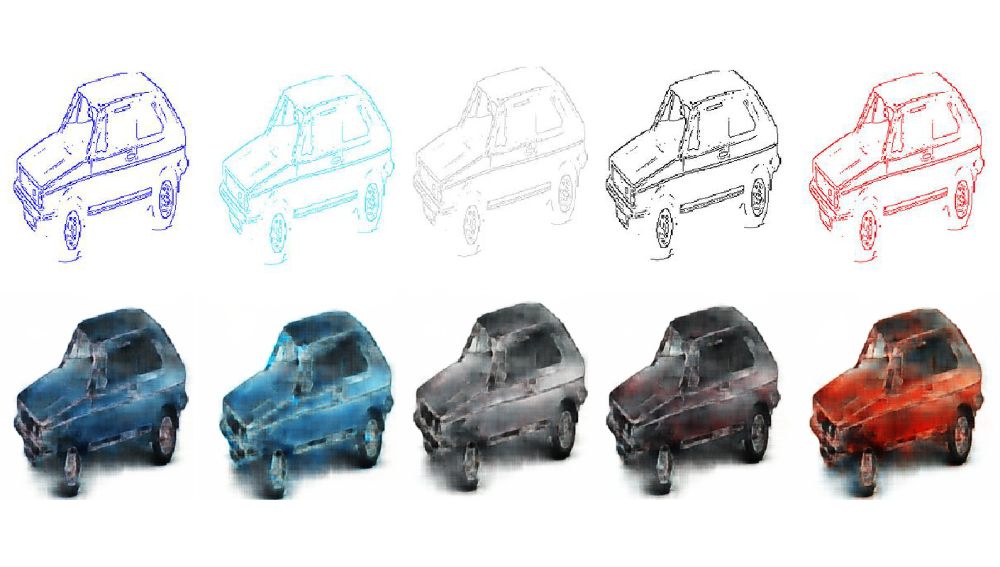

# edges2car

Tensorflow implementation of pix2pix model to transfer style from colored drawings of cars to realistic images of cars.

**Interactive interface:** [Website](https://georgezjchen.github.io/draw-a-car-build/)

**More details :** [Internship report](https://drive.google.com/open?id=1MaZShjkUqU0jz4ylh64zxypOqDjbe8s4)

## Some results

